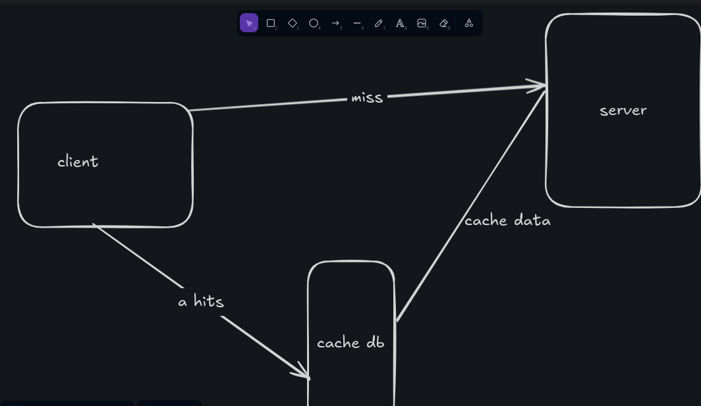

# 🧰 Cache Proxy

A lightweight caching reverse proxy server built with Go and Redis. It forwards requests to an origin server and caches JSON responses to reduce latency and load. Cached responses are served with custom headers to indicate cache status.

---

## 🚀 Features

- Caches JSON responses using Redis `redisJSON`
- Customizable cache duration via `--max-age` flag
- Adds `X-Cache` header to indicate cache status:
  - `X-Cache: HIT` → Response served from cache
  - `X-Cache: MISS` → Response fetched from origin and cached
- Gracefully handles dynamic paths and query parameters
- Optionally clears all user cache on start with `--clear-cache`

---

## 🛠 Flags

| Flag            | Type   | Description                                                                 |
|-----------------|--------|-----------------------------------------------------------------------------|
| `--port`        | int    | Port to run the proxy server on                                             |
| `--origin`      | string | Origin server base URL                                                      |
| `--max-age`     | int    | Cache expiration time in seconds (default: `86400` = 24h)                   |
| `--clear-cache` | bool   | If provided, clears user cache in Redis before the server starts            |

---

## 🧪 Example Usage

```bash
./cache-proxy --port 8080 --origin http://dummyjson.com --max-age 86400
````

With cache cleared before start:

```bash
./cache-proxy --clear-cache
```

Then, making a request to:

```bash
curl -i http://localhost:8080/products
```

Will forward the request to:

```
http://dummyjson.com/products
```

* If it's a first-time request → response is fetched and cached → `X-Cache: MISS`
* If repeated within the cache duration → served from cache → `X-Cache: HIT`


## 🧾 Requirements

* Go 1.20+
* redis 8.0+
* Redis running locally

---

## 🗺️ Architecture Diagram


